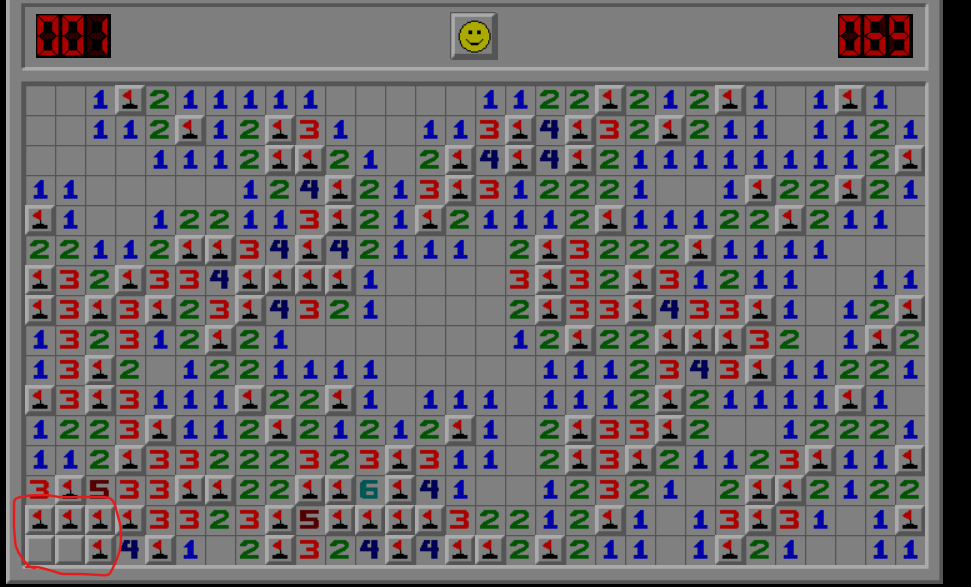
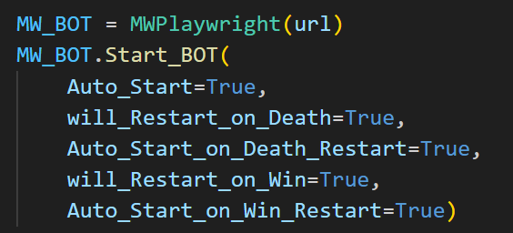

# How the bot works?
Let's understand how actually bot works.

Firstly, you need to choose between 3 game modes. Then the browser and the website will open and start updateing cell data.

## How it "updates" cell data?
We can get the website's DOM (Document Object Model) or what I like to say "Live HTML". As you can see at the bottom DOM can give us what we need but how will we get them?

Because we opened the browser with Playwright, we can get all DOM structure whenever we want and filter it to get what we want. But isn't there any better way to do that?

Well, yes. We can use the browser to get cell data we need. Because we use the browser we can use Javascript code to filter and get cell data and it is faster than getting *all* DOM then filtering it in Python. After we get filtered cell data, we are going to process it in Python then feed it to other functions. 

## Then what is after updateing cell data?
Quick answer is useing logical actions. But what are those actions that led us to win the game?

#### 1) Basic Logic:
This function does 2 things:
- If the number on the cell equals the amount of neighbor flags, it opens all unopened safe cells.
- If the amount of unopened cells equals the number on the cell, it flags all unopened cells.
  
#### 2) Difference Logic:
This function looks for the difference (neighbors as in sets) of 2 cells. Then uses mathematical set logic to solve.

#### 3) Two Steps Ahead Logic:
This function searches connection between 2 cells which have an unopened cell between. Then uses mathematical set logic to solve.

#### 4) No Unflagged Bomb Left Action:
This function opens all unopened cells if all the bombs are found.

#
But are they enough, do you need only this much logical action to win the game?

Well, no. As you know sometimes minesweeper is only a guessing game and you can't do anything with logics so we need some non-logical actions and here they are:

#### 1) Non-Logical Neighbor Action:
This function only works if logical actions doesn't work.

Firstly it looks all the cells those have some unopened neighbors and calculates the chance of any of than being bomb (amount of unopened neighbors / the cell's value (the number on cell - found neighbor bombs)).
After that, it chooses the lowest risked cell then opens one neighbor of the lowest risked cell.

#### 2) Open First Unknown(Unopened) Action:
This function only works if both logical actions and "Non-Logical Neighbbor Action" doesn't work.

Sometimes there could be a situation which I call "prison". Flags are blocking us to reach the remaining cells and we stuck. Thats when this function will work.

This is very simple function. It only opens the first unopened cell to break "prison".

#### Example of a "prison":

# Setting The Settings:

As you can see, there are 5 parameters at the bot's main (starting) function, which I refer to as "settings". Let's see what is their meanings.

#### 1) AUTO START: 
- ( True / False ; Default = False )
- This is automatic "first click" parameter. If you make this parameter "True", the bot will automaticly start the game when page is loaded; else if you leave this parameter as "False", the bot won't start until you open the first cell.

#### 2) Will Reset On Death: 
- ( True / False ; Default = True )
- If you leave this parameter as "True", the bot will automaticly restart if it dies; else if you make this parameter "False", the bot won't restart when it dies and you have to click the face emoji in order to restart and then click a cell to start the bot again.

#### 3) Auto Start on Death Restart:
- ( True / False ; Default = True )
- This parameter only makes a difference when 'Will Restart On Death' is "True".
- If you leave this parameter as "True", the bot will automaticly open the first cell when "Will Restart On Death" restarts the game; else if you make this parameter "False", it won't open the first cell.

#### 4) Will Reset On Win: 
- ( True / False ; Default = False )
- If you make this parameter "True", the bot will automaticly restart if it wins; else if you leave this parameter as "False", the bot won't restart when it wins and you have to click the face emoji in order to restart and then click a cell to start the bot again.

#### 5) Auto Start on Win Restart: 
- ( True / False ; Default = True )
- This parameter only makes a difference when 'Will Reset On Win' is "True".
- If you leave this parameter as "True", the bot will automaticly open the first cell when "Will Reset On Win" restarts the game; else if you make this parameter "False", it won't open the first cell.

# More Explanation
## Chance Calculator's Cumulative Probability:
If you look at the statistics of survival chances on death and win, you'll see that the average survival chance on win is actually lower than on death. And it looks a bit strange. The reason for this is:

In order for the bot to win the game, it has to survive all the luck-based situations. Since there are many of them, the cumulative survival chance gets lower and lower. However, the survival chance on death is different. For example, in a 50/50 situation, if the bot picks the bomb cell to open and dies, the survival chance would be 50%. But if the bot picks the safe cell to open, it can find itself with another 50/50 situation and if it dies there, the survival chance would be 25%. So, when the bot dies early, it doesn't face all the possible risks, which makes its recorded survival chance higher than a full winning run.

## Integer Score Recording:
If you look at the win times (scores), you'll see they are all integers. This is because I fetch these scores directly from the page, and the page does not support floats (decimals). This makes the score calculation less accurate. For example, if the bot wins the game in anywhere between 1.1 and 1.9 seconds, the score is rounded to 2.
